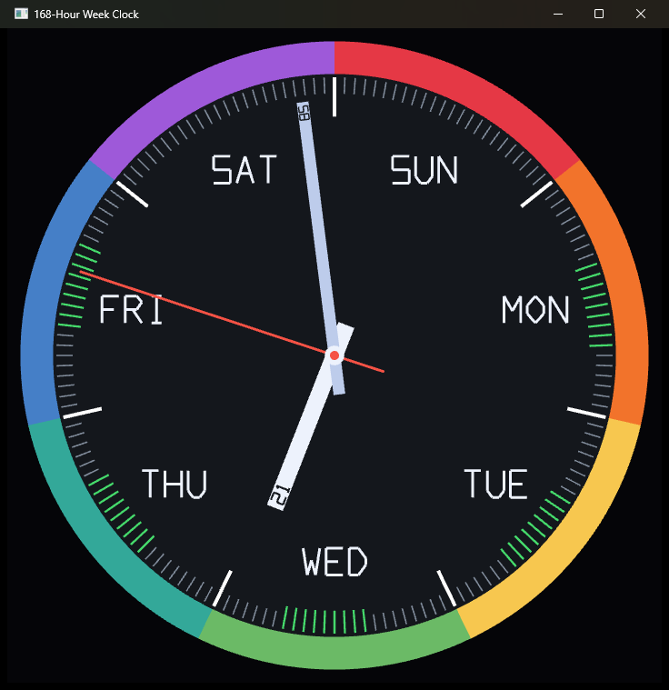

# 168‑Hour Week Clock

[](https://github.com/DrakoTrogdor/168_clock/actions/workflows/ci.yml)

> A desktop clock whose hour hand sweeps the **entire week**, not just 12 hours. One full revolution = 168 hours, Sunday 00:00 → Saturday 23:59:59.

<p align="center">
  
</p>

A small native desktop app (Windows · macOS · Linux) written in Rust and rendered on the GPU with [`wgpu`](https://github.com/gfx-rs/wgpu). Instead of a 12‑hour dial, the face is divided into **7 days × 24 hours = 168 ticks**, so the slow hand tells you where you are in the *week* at a glance. The minute and second hands behave normally.

---

## Features

- **168‑hour dial** — the hour hand makes one full turn per week; each of the 168 ticks is one hour.
- **Normal minute & second hands** — 60 divisions each, with a smooth (sub‑second) second sweep.
- **Seven‑color bezel & day labels** — one colored arc and one name (SUN … SAT) per day.
- **Work‑hours highlight** — the 9 am–5 pm ticks on Monday–Friday are marked in green.
- **Numeric readouts on the hands** — the hour hand's tip shows the hour (`00`–`23`), the minute hand's tip shows the minute (`00`–`59`), engraved into each hand.
- **"Business‑hours" color cue** — those tip numbers sweep **green → amber → red** during the weekday workday (amber at noon) and stay dark otherwise.
- **Full‑screen desktop‑widget mode** — press **F11** to go borderless and clip the window to the clock face, so the desktop shows through around it.
- **No font dependency** — all text is a tiny built‑in vector stroke font drawn with the same triangle pipeline.

## How to read it

| Element | Meaning |
| --- | --- |
| **Hour hand** (short, stout) | Points at the current **hour of the week** — 168 positions, one full turn per week. 12 o'clock is **Sunday 00:00**, advancing clockwise. Its tip shows the hour of day, `00`–`23`. |
| **Minute hand** (long, thin) | Normal — one turn per hour. Its tip shows the minute, `00`–`59`. |
| **Second hand** (red, sweeping) | Normal — one turn per minute. |
| **168 tick marks** | The only graduations on the face — one per hour of the week. The 7 day boundaries (midnights) are longer and white. |
| **Colored bezel** | Seven arcs, one per day, Sunday → Saturday clockwise. |
| **Green ticks** | The 9 am–5 pm hours, Monday–Friday. |
| **Hand‑tip number color** | Dark on weekends and outside 9–5; green→amber→red during the weekday workday (peak amber at noon). |

## Controls

| Key | Action |
| --- | --- |
| **F11** | Toggle borderless full‑screen. The title bar is removed and everything outside the clock face becomes transparent (the desktop shows through). |
| **Esc** | Exit full‑screen. |
| Close button | Quit. |

## Building & running

### Prerequisites

- [Rust](https://rustup.rs/) (stable toolchain, edition 2021).
- Windows 10/11 with a Direct3D 12‑capable GPU.

### Run

```sh
cargo run --release
```

### Build a standalone binary

```sh
cargo build --release
```

The executable is written to `target/release/week-clock.exe`. Release builds use the `windows` subsystem, so no console window is shown.

## How it works

- **Rendering** — the whole clock is rebuilt every frame as a few thousand colored triangles (face, bezel, ticks, labels, hands) and uploaded to a single vertex buffer. A minimal 2D pipeline with 4× MSAA draws it. There is no retained scene graph; the CPU‑side geometry is cheap enough to regenerate per frame.
- **Time** — local time (including DST) comes from [`chrono`](https://github.com/chronotope/chrono); the hour‑of‑week, minute, and second are turned into hand angles.
- **Text** — digits and day names are a hand‑authored vector stroke font (`glyph()` in `src/main.rs`), so there's no glyph‑rasterization or font‑atlas dependency.
- **Full‑screen transparency** is handled per platform:
  - **Windows** — the window is clipped to the clock circle with a Win32 window region (`SetWindowRgn`); a shaped window forces DWM composition, so the see‑through effect works even full‑screen. (Per‑pixel GPU alpha is unreliable with DXGI flip‑model swapchains.)
  - **macOS / Linux** — a transparent window plus a non‑opaque surface alpha mode; in full‑screen the background is cleared to alpha 0, leaving only the opaque clock circle so the desktop shows around it. macOS uses *simple* full‑screen (not a separate Space) to keep the live desktop behind the clock.

## Platform support

| OS | Status | Transparent full‑screen |
| --- | --- | --- |
| **Windows 10/11** | Built & tested | Window‑region clip |
| **Linux** (Wayland, or X11 + compositor) | Builds & initializes (verified on WSL2 Debian 13) | GPU alpha |
| **macOS** | Cross‑platform code, not verified | GPU alpha (simple full‑screen) |

Windows is the primary, tested target. The Linux build is verified to compile and bring up `winit` + `wgpu` (Vulkan), selecting the transparency‑capable surface path. The macOS path uses the standard `winit`/`wgpu` approach but has not been verified — please report issues.

- **Linux** needs a compositing window manager for the transparency (always present under Wayland; under X11, run a compositor such as `picom`). Without one, full‑screen simply shows the opaque dark background.
- **macOS** keeps the desktop visible behind the clock by using *simple* full‑screen rather than a separate Space.

## Built with

- [`wgpu`](https://github.com/gfx-rs/wgpu) — GPU rendering (Direct3D 12 on Windows, Metal on macOS, Vulkan on Linux)
- [`winit`](https://github.com/rust-windowing/winit) — windowing and input
- [`chrono`](https://github.com/chronotope/chrono) — local time
- [`bytemuck`](https://github.com/Lokathor/bytemuck), [`pollster`](https://github.com/zesterer/pollster) — glue; [`raw-window-handle`](https://github.com/rust-windowing/raw-window-handle) for the window handle (Windows only)

## Project layout

```
.
├── src/
│   └── main.rs      # the entire app: rendering, geometry, font, input
├── Cargo.toml
└── README.md
```

## Contributing

`main` is protected — changes land via pull request with green CI. A typical loop:

```sh
git switch -c my-change
# ...edit...
cargo run --release                          # see it
cargo clippy --all-targets -- -D warnings    # CI enforces this
git commit -am "Describe the change"
git push -u origin my-change
# open a PR; once CI (build + clippy on Windows/Linux/macOS) is green, merge
```

CI ([ci.yml](.github/workflows/ci.yml)) runs `cargo build` and `cargo clippy -D warnings` on Windows, Linux, and macOS for every push and pull request.

### Cutting a release

Push a semver tag and the [release workflow](.github/workflows/release.yml) builds and uploads native binaries for all three platforms to a new GitHub Release:

```sh
git tag v0.1.0
git push origin v0.1.0
```

### Icons

The icon is generated from [`assets/icon.svg`](assets/icon.svg) (by `scripts/gen_icon.py`). Run `scripts/build-icons.sh` to regenerate the raster assets — `icon.png`, `icon.ico`, `icon.icns` — which needs `librsvg2-bin`, `icoutils`, and `icnsutils`.

- **Windows** — `icon.ico` is embedded into the `.exe` at build time (`build.rs` + `winresource`) and also set as the runtime window icon.
- **Linux** — set as the runtime window icon (X11; under Wayland the icon comes from a `.desktop` file).
- **macOS** — winit can't set a window icon, so build a `.app` with [`cargo-bundle`](https://github.com/burtonageo/cargo-bundle) (`cargo install cargo-bundle && cargo bundle --release`); it uses `assets/icon.icns` via the `[package.metadata.bundle]` config.

## License

Released under the [MIT License](LICENSE).
